<!-- ░░ Header ░░ -->

  

  

  

# Hi, I'm Elina ✦

**UI/UX & Product Designer** focused on clear systems, thoughtful interactions, and interfaces that feel effortless.

I spend most of my time turning messy product problems into calm, usable digital experiences.

 

### What I do

  

`Product Design` · `UI/UX` · `Design Systems` · `Prototyping`

Mostly designing **SaaS products, dashboards, marketplaces, and digital platforms** in Figma.

 

### How I work

  

  

 

### Elsewhere

  
  
  
  
  
  

 

  

  

<!-- ░░ Footer ░░ -->

